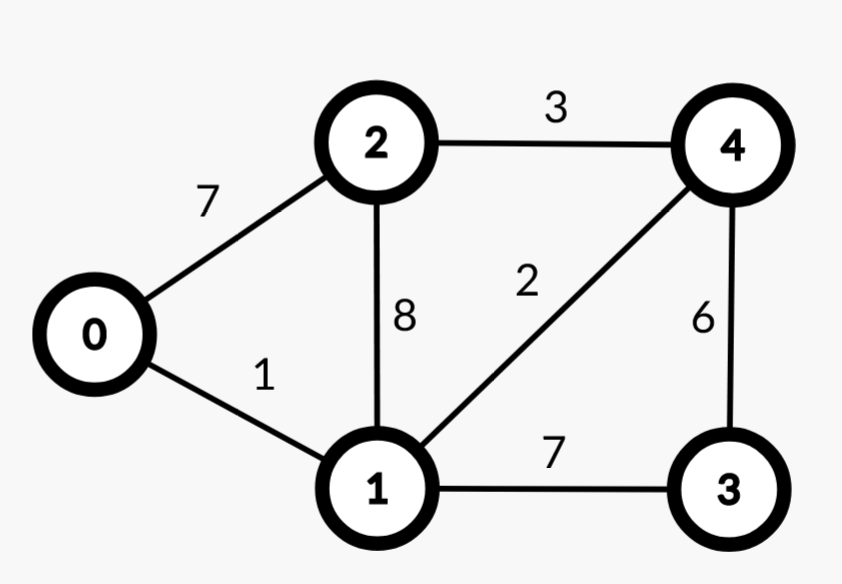

# Упражнение 13

# Най-кратък път в граф

## Миналия път разгледахме

- Обхождане в ширина на граф (BFS)
- Обхождане в дълбочина на граф (DFS)
- Топологична сортировка (Topological sorting)

## Въпроси от миналия път

- :)

Решения от [домашно 10](https://hackerrank.com/contests/sda-ad-hw-10-2023) - [тук](/Homeworks/hw_10).

## Днес ще разгледаме

- Претеглен граф (Weighted graph)
- Алгоритъм на Дейкстра (Dijkstra)
- Алгоритъм на Белман-Форд (Bellman-Ford)

## Непретеглен граф

- Най-кратък път в непретеглен граф се намира чрез Breadth-first search (BFS).
- Не е нужно използването на по-сложни алгоритми като този на Дийкстра.
- Непретеглен граф може да се представи като претеглен такъв, където всички ребра са с равна тежест (единица).

## Претеглен граф

- Граф, при който всяко ребро има тежест.
- Тежестта може да представлява цена, разстояние, капацитет и т.н.
- Представянето може да се реализира, чрез списък на съседство. Всеки връх притежава списък от наредените двойки - съседен връх и тегло на реброто.



```python
undirected_graph = {
    0: [(2, 7), (1, 1)],
    1: [(0, 1), (2, 8), (3, 7), (4, 2)],
    2: [(0, 7), (1, 8), (4, 3)],
    3: [(1, 7), (4, 6)],
    4: [(3, 6), (1, 2), (2, 3)]    
}
```
  
## Dijkstra's algorithm (Алгоритъм на Дейкстра)

- [Greedy](https://en.wikipedia.org/wiki/Greedy_algorithm) алгоритъм, който пресмята най-кратък път от начален връх до всички останали в претеглен граф.
- Сложността по време зависи от използваната структура.
- При използването на *Binary Heap* сложността е *O(E\*logV)*.
- Алгоритъмът не работи правилно при наличие на ребро с отрицателна тежест.

```python
from heapq import heappop, heappush

INF = float('infinity')

def dijkstra(start, V, graph):
    distances = [INF] * V
    distances[start] = 0

    visited = set()
    
    pq = [(0, start)]
    
    while pq:
        total_weight, current = heappop(pq)
        
        if current in visited:
            continue
        visited.add(current)
        
        for neighb, added_weight in graph[current]:
            if neighb in visited:
                continue
                
            new_weight = total_weight + added_weight
            
            if distances[neighb] == INF or new_weight < distances[neighb]:
                distances[neighb] = new_weight
                heappush(pq, (new_weight, neighb))
    
    return distances

dijkstra(0, 5, undirected_graph) # [0, 1, 6, 8, 3]
```

Алгоритъм:
1. Отбелязваме всички върхове като недостижми (дистанцията до тях е безкрайност).
2. Започваме от началния връх, като дистанцията до него е 0. Маркираме го като посетен - най-кратката дистанция до него вече е намерена.
3. Изчисляваме дистанция до всеки непосетен връх,съседен на текущия, като сбор от текущата дистанция и тежестта на реброто свързваща двата върха.
4. Ако новата дистанция е по-малка от записаната за върха, обновяваме дистанцията. Добавяме в приоритетна опашка новата намерена дистанция до конкретния връх заедно с върха.
5. Взимаме върха с най-кратка дистанция от приоритетната опашка и повтаряме *стъпки 3, 4 и 5* до изчерпване на върховете в опашката. При взимане на върха от приоритетната опашка,
сме сигурни, че най-кратката дистанция до него е намерена и го бележим като посетен. Пропускаме итерация при взимането на вече посетен връх от приоритетната опашка, тъй като по-кратки пътища от него не можем да намерим.

Пример в [playground-а](playground_13.ipynb).

## Bellman-Ford algorithm (Алгоритъм на Белман-Форд)


## Задачи за упражнение

- [Dijkstra: Shortest Reach 2](https://www.hackerrank.com/challenges/dijkstrashortreach/problem)
- [Network Delay Time](https://leetcode.com/problems/network-delay-time)
- [Long Long](https://www.hackerrank.com/contests/sda-hw-11/challenges/long-long)
- [Path with Maximum Probability](https://leetcode.com/problems/path-with-maximum-probability)

Решения на задачите: [тук](/Tasks/tasks_13)