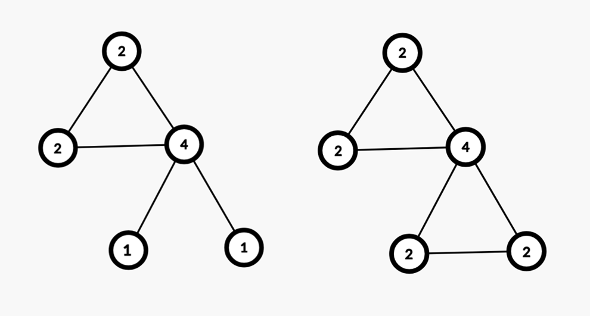

# Упражнение 15

# Ойлеров и Хамилтонов път в граф

## Миналия път разгледахме

- Алгоритъм на Прим
- Алгоритъм на Крускал

## Въпроси от миналия път

- :)

Решения от [домашно 11](https://hackerrank.com/contests/sda-ad-hw-11-2023) - [тук](/Homeworks/hw_11).

Решения от [контролно 6]() - [тук](/Exams/exam_06).

## Днес ще разгледаме

- Ойлеров път в граф (Eulerian path)
- Хамилтонов път в граф (Hamiltonian path)
- NP, NP complete, NP hard проблеми
  
## Ойлеров път и Ойлеров цикъл 

### Ойлеров път (Eulerian path)

- Ойлеровият път минава през всяко едно **ребро** на даден граф само по един път.
- Допуска се преминаването през даден възел повече от един път.
- Граф притежава Ойлеров път, ако има **точно 2 възела** с **нечетна** степен.
- Степен на връх е броя на ребрата, чрез които той е свързан с другите върхове.
- Ойлеровият път винаги започва от един от върховете с нечетна степен и приключва в другия.

### Ойлеров цикъл (Eulerian cycle)

- Частен случай на Ойлеровия път.
- Ойлеровият цикъл е път, който минава през всяко едно **ребро** на даден граф само по един път, като свършва във върха, от който е тръгнал.
- Граф притежава Ойлеров цикъл, ако **всички** възли в графа са от четна степен.
- Цикълът може да започне от който и да е възел.

## Задачи за упражнение

- 

Решения на задачите: [тук](/Tasks/tasks_15)