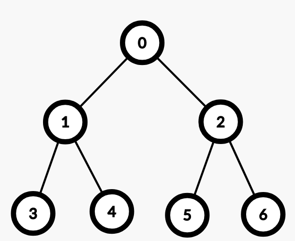
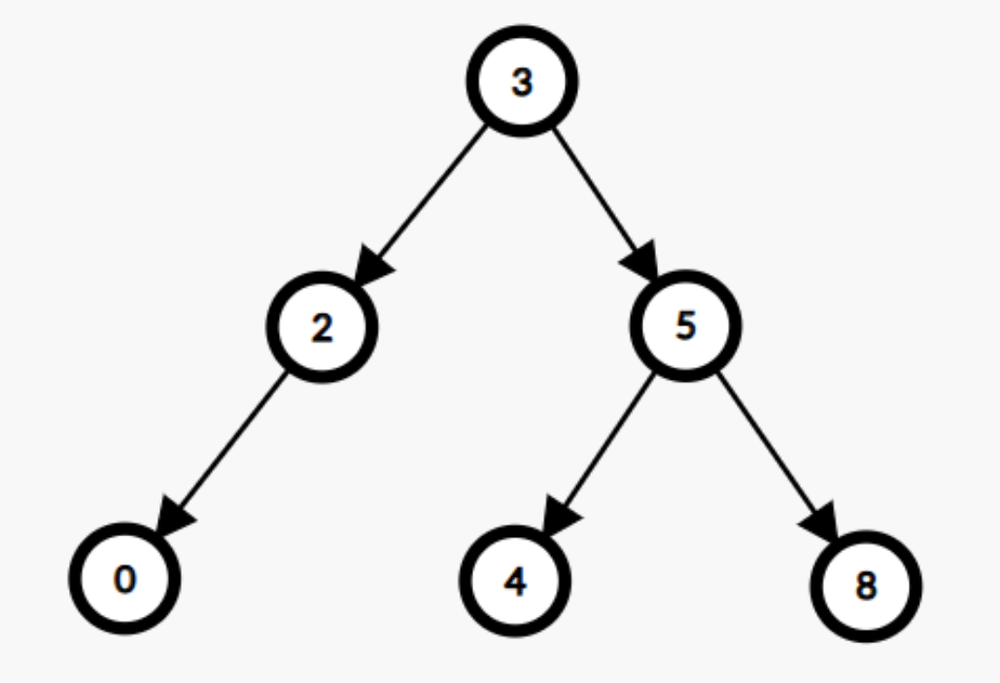

# Упражнение 7

# Дървета

## Миналия път разгледахме

- Стек
- Опашка
- Опашка с 2 края (Deque)

## Въпроси от миналия път/ домашното

- :)

Решения от [домашно 5](https://hackerrank.com/contests/sda-ad-hw-5-2023) - [тук](https://github.com/TeogopK/SDA-solved/tree/main/Homeworks/hw5).

## Днес ще разгледаме

- Дървета
- Двоични дървета
- Двоични дървета за търсене (BST)
- Алгоритми за обхождане на дървета

## Tree (Дърво)

- Нелинейна структура от данни, която се състои от възли, подобно на свързания списък. Един възел може да има няколко наследника, но само 1 предшественик.
- Дървото се характеризира с липсата на цикли - *Ацикличен свързан граф*.
- Възли без наследници се наричат *листа*.
- Коренът на дървото е възелът без нито един предшественик.

## Binary Tree (Двоично дърво)

- Дърво, чиито възли имат най-много двама наследника. Най-често се обозначават ляв и десен (left, right).
  
Пример:




## Binary Search Tree (Двоично дърво за търсене)

- Дефинира се рекурсивно по следния принцип:
1. Всяко листо е двоично дърво за търсене.
2. Всяко поддърво започващо от даден възел е двоично дърво за търсене, ако:
    - Най-големият елемент в лявото му поддърво е по-малък от стойността в дадения възел.
    - Най-малкият елемент в дясното му поддърво е по-голям от стойността в дадения възел.
    - И лявото поддърво, и дясното поддърво са двоични дървета за търсене.

Примерно двоично дърво за търсене:



## Алгоритми за обхождане

### Depth-first search (Обхождане в дълбочина)

Алгоритъмът започва от корена и обхожда колкото се може по-надълбоко в даден клон, преди да започне да се връща наобратно.

#### Inorder traversal
- Извежда във възходящ ред стойностите на двоично дърво за търсене.
- Схема: *Ляво - Корен - Дясно* 

```python
def inorder(current):
    if current is None:
        return
    
    inorder(current.left)
    print(current.val, end=' ') # 0 2 3 4 5 8 
    inorder(current.right)
```

#### Preorder traversal 
- Коренът е винаги първи.
- Схема: *Корен - Ляво - Дясно*

```python
def preorder(current):
    if current is None:
        return
    
    print(current.val, end=' ') # 3 2 0 5 4 8
    preorder(current.left)
    preorder(current.right)
```

#### Postorder traversal
  - Коренът е винаги последен. 
  - Схема: *Ляво - Дясно - Корен*

```python
def postorder(current):
    if current is None:
        return
    
    postorder(current.left)
    postorder(current.right)
    print(current.val, end=' ') # 0 2 4 8 5 3 
```

#### Iterative DFS
Обхождането в дълбочина може да се направи и без рекурсия чрез използването на стек:

```python
def inorder_stack(root):
    stack = []
    current = root

    while stack or current:
        if current:
            stack.append(current) 
            current = current.left
        else:
            current = stack.pop()
            print(current.val, end=' ') # 0 2 3 4 5 8 
            current = current.right
```

#### Recursion limit
Възможно е да се увеличи ограничението за максимална дълбочина на рекурсия в Python, вместо да се пишат итеративни варианти на алгоритмите, чрез следния код:

```python
import sys
sys.setrecursionlimit(10_000)
```

---

### Breadth-first search (Обхождане в широчина)
- Нарича се още *Level order traversal*.
- Схема: *корен - дълбочина 1 - дълбочина 2 - ...*

```python
from collections import deque

def bfs_deque(root):
    q = deque([root])
    level = 0

    while q:
        length = len(q)
        print(f"Level {level}:", end=' ')

        for _ in range(length):
            current = q.popleft()
            print(current.val, end=' ')

            if current.left:
                q.append(current.left)
            if current.right:
                q.append(current.right)

        print()
        level += 1
        
"""
Output:
Level 0: 3 
Level 1: 2 5 
Level 2: 0 4 8
"""
```

Разяснение на алгоритъма:
1. Обхожда първото ниво - корена, като добавя неговите наследници в опашка.
2. Преминава на следващото ниво - децата на корена. Текущият брой на елементите в опашката е броят на децата.
3. Премахва първия елемент от опашката (първото дете) и добавя неговите наследници ("внуците" на корена) в края на опашката.
4. Продължава да повтаря *стъпка 3*, докато не премине през всички деца от *стъпка 2*.
5. След преминаването през всички деца, в опашката се съдържат единствено върхове добавени от второто ниво - това са "внуците" на корена.
6. Стъпките се повтарят до изчерпване на възлите в дървото - когато се изпразни опашката с възли за обхождане.
   

## Сложност по време на основните операции:

| Операция | Worst case | Average case |
| --- | --- |  --- |
| търсене | *O(N)* | *Θ(logN)* |
| добавяне | *O(N)* | *Θ(logN)* |
| триене | *O(N)* | *Θ(logN)* |


## Имплементации в Python

Няма вградено двоично дърво за търсене в Python.
Ако искаме да ползваме такова, ще трябва да си го напишем сами.


Примерна имплементация в [playground-а](playground_07.ipynb).

## Задачи за упражнение

- [Binary Tree Inorder Traversal](https://leetcode.com/problems/binary-tree-inorder-traversal)
- [Maximum Depth of Binary Tree](https://leetcode.com/problems/maximum-depth-of-binary-tree)
- [Search in a Binary Search Tree](https://leetcode.com/problems/search-in-a-binary-search-tree)
- [Validate Binary Search Tree](https://leetcode.com/problems/validate-binary-search-tree)
- [Same Tree](https://leetcode.com/problems/same-tree)
- [Symmetric Tree](https://leetcode.com/problems/symmetric-tree)
- [Binary Tree Level Order Traversal](https://leetcode.com/problems/binary-tree-level-order-traversal)

Решения на задачите: [тук](https://github.com/TeogopK/SDA-solved/tree/main/Seminar/sem_07)