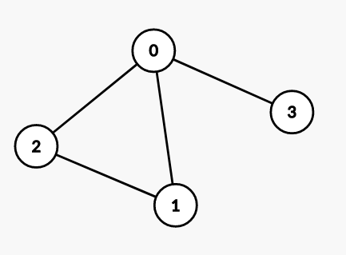

# Упражнение 12

# Oбхождане на граф

## Миналия път разгледахме

- Хештаблица

## Въпроси от миналия път/ контролното

- :)

Решения от [домашно 9](https://hackerrank.com/contests/sda-ad-hw-9-2023) - [тук](https://github.com/TeogopK/SDA-solved/tree/main/Homeworks/hw9).

## Днес ще разгледаме

- Представяне на граф
- Обхождане в ширина на граф (BFS)
- Обхождане в дълбочина на граф (DFS)
  
## Граф

Графът е нелинейна структура от данни, която представлява връзките между отделните елементи на дадено множество. Всеки член на това множество се нарича връх (*V*), а връзката между два върха се нарича ребро (*E*).

### Ориентиран граф (Directed graph)
- Всяко ребро има посока.
- Ако съществува ребро от връх А до връх В, то позволява преминаването само от А към Б.

Пример:


Съществува път от 0 до 4, но не и от 4 до 0.

### Неориентиран граф (Undirected graph)
- Ребрата нямат посока.
- Ако съществува ребро между връх А и връх Б, то позволява преминаването от А към Б и от Б към А.

Пример:


Съществува път както от 0 до 4, така и от 4 до 0.

## Представяне на граф

### Матрица на съседство (Adjacency matrix)

- Връзките между върховете се представят чрез булева матрица (*А*).
- Ако съществува ребро от връх *V<sub>i</sub>* до *V<sub>j</sub>*, клетката *А<sub>ij</sub> = 1*.
- Матрицата е симетрична при ненасочен граф.
- Изисква *V<sup>2</sup>* допълнителна памет.
- Позволява константа проверка дали има ребро между два върха.
- Подходящо представяне за [*dense*](https://en.wikipedia.org/wiki/Dense_graph) графи.

Пример:



```python
graph = [
    [0, 1, 1, 1],
    [1, 0, 1, 0],
    [1, 1, 0, 0],
    [1, 0, 0 ,0]
]
```

### Списък на съседство (Adjacency list)

- Всеки връх съдържа списък с върховете, до които има непосредствени ребра (съседите).
- Ако съществува ребро от връх *V<sub>i</sub>* до *V<sub>j</sub>*, списъкът на съседство на *V<sub>i</sub>* ще съдържа връх *V<sub>j</sub>*.
- Изисква *V + Е* допълнителна памет.
- Не предоставя константа проверка дали има ребро между два върха.
- Подходящо представяне за *sparse* графи.
- При *dense* графи, когато *E* клони към *V<sup>2</sup>*, по-подходящо ще е представяне чрез матрица на съседство.

```python
graph = {
    '0': set([1, 2, 3]),
    '1': set([0, 2]),
    '2': set([0, 1]),
    '3': set([0])
}
```

## Breadth First Search

Алгоритъм:
1. Разделя възлите на посетени и непосетени.
2. Започва да обхожда от подаден начален връх.
3. Добавя всички съседи, които не са посетени, към края на опашка от върхове за следващо обхождане.
4. Взима първия елемент от опашката и повтаря стъпка 3, докато има елементи в опашката.

Свойства:
- Намира най-къс път от даден възел до всички останали в непретеглен граф (всички ребра са с еднаква дължина/ тежест).
- Стои в основата на по-сложни алгоритми като Алгоритъм на Дийкстра.
- *O(V + E)* сложност по време.

## Depth First Search

Алгоритъм:
1. Разделя възлите на посетени и непосетени.
2. Започва да обхожда от подаден начален връх.
3. Добавя всички съседи, които не са посетени, към края на стек* от върхове за следващо обхождане.
4. Взима първия елемент от стека и повтаря стъпка 3, докато има елементи в стека.

Свойства:
- Удобен за намиране на компоненти на свързаност, проверка за цикъл в граф и топологична сортировка. (*Забележка: Възможно е и използването на BFS за решаване на горните проблеми.)
- *O(V + E)* сложност по време.

## Топологична сортировка

- Подрежда върховете, така че всеки възел се намира преди наследниците си, към които има ребра.
- Работи за [DAG](https://en.wikipedia.org/wiki/Directed_acyclic_graph) (Directed Acyclic Graph).

[Пример:](https://assets.leetcode.com/users/images/63bd7ad6-403c-42f1-b8bb-2ea41e42af9a_1613794080.8115625.png)


## Задачи за упражнение

- [Breadth First Search: Shortest Reach](https://www.hackerrank.com/challenges/bfsshortreach/problem)
- [Count of areas](https://www.hackerrank.com/contests/sda-2021-2022-test-6-christmas/challenges/challenge-2351)
- [Cyclic graph](https://www.hackerrank.com/contests/sda-homework-10/challenges/-1-12)
- [Course Schedule II](https://leetcode.com/problems/course-schedule-ii)

